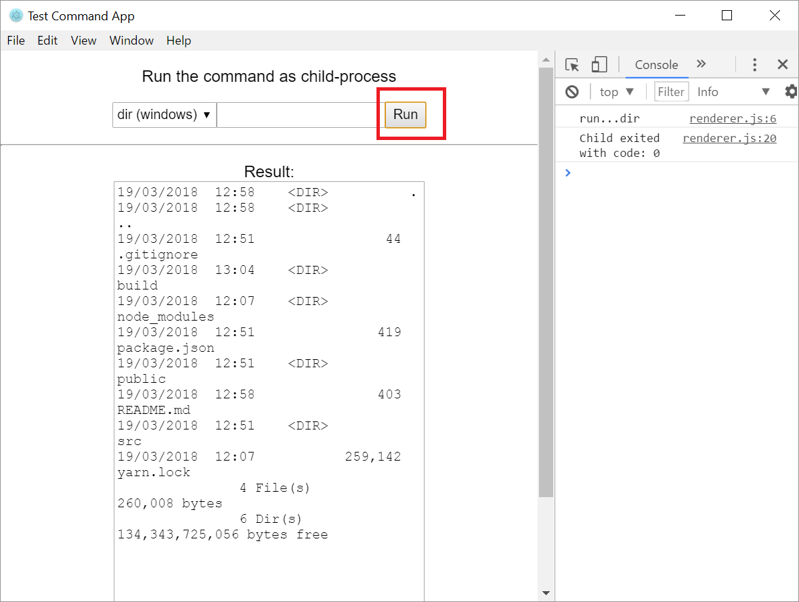

# electron-react-childprocess-example
This is example to run local command from Electron/React app as child-process.

## Installation

Setup developement enviornment:

```
npm install --global yarn

yarn install
```
Run in developement-mode:

```
yarn build & electron .
```

## Note

Developement require [NodeJS](https://nodejs.org/en/) and/or [Python](https://www.python.org/). 


